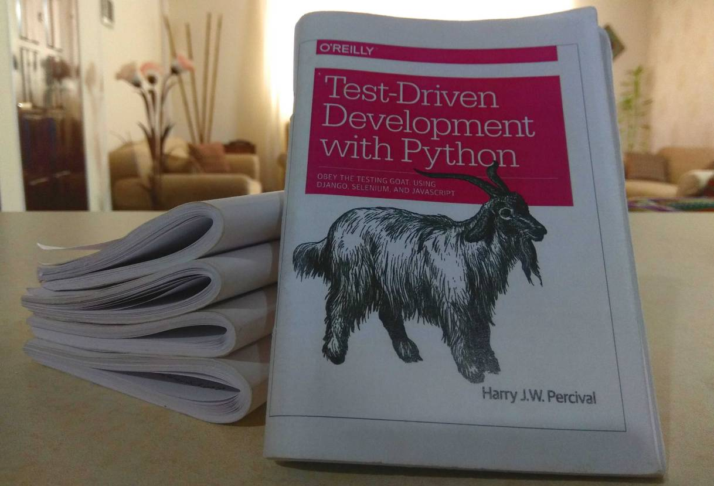
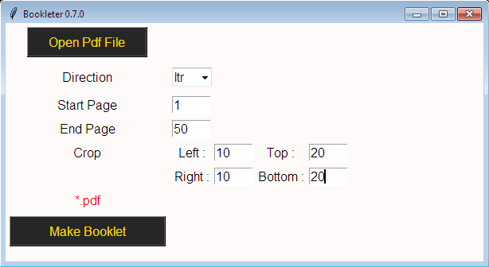

# bookleter
##### Turns pdfs into a6 sized foldable booklets



## install
```console
$ pip install bookleter==0.1.0
```

## usage
```console
$ bookleter [pdfname] [start_page-end_page] [direction: rtl ltr] [margin percentage: 50]
```
### example
```console
$ bookleter my_book.pdf 1-30 rtl 50
```

<div dir="rtl"> 
  روش نصب:
</div>

```console
$ pip install bookleter
```

<div dir="rtl">
برای استفاده از این برنامه دو راه داریم:</br>
روش اول: از طریق خط فرمان
</div>

```console
$ bookleter  [pdfname]  [startPage-endPage]  [direction: rtl ltr]  [margin percentage: 50]
$ bookleter   my_book.pdf  1-80  rtl  50
```
<div dir="rtl"> 
اسم فایل (pdfname)</br>
از صفحه‌ی فلان (startPage) تا صفحه‌ی فلان (endPage)</br>
جهت چینش بر اساس زبان کتاب، راست به چپ یا چپ به راست (direction)</br>
rtl (Right To Left) or ltr(Left To Right)</br>
درصد کاهش مارجین (margin percentage): مارجین جدید کتاب چند درصد از مارجین اصلی باشه؟ مثلا عدد ۵۰ یعنی مارجین جدید نصف مارجین اصلی اعمال میشه.</br> 
روش دوم : از طریق محیط گرافیکی</br>
با اجرای دستور bookleter بدون ورودی محیط گرافیکی براتون باز میشه
</div>

```console
$ bookleter
```



<div dir="rtl">
که استفاده ازش نیازی به توضیح نداره.</br>
در پایان اجرای برنامه دو تا فایل براتون ایجاد میشه با نام های</br>
my_pdf_print_this.pdf</br>
 my_pdf_print_this_for_test.pdf</br>
که فایل تست یه فایل ۸ صفحه‌ای هست برای چاپ یه نمونه‌ کتابچه‌ی ۸ صفحه‌ای(یک برگه آ۴ پشت و رو هر طرف ۴ صفحه)، که قبل از چاپ کتابچه‌ی اصلی با چاپ این کتابچه‌ی تست می‌تونیم از درستی کارمون مطمئن شیم.</br>

[روش چاپ و اطلاعات بیشتر](https://www.google.com)</br>

</div>

